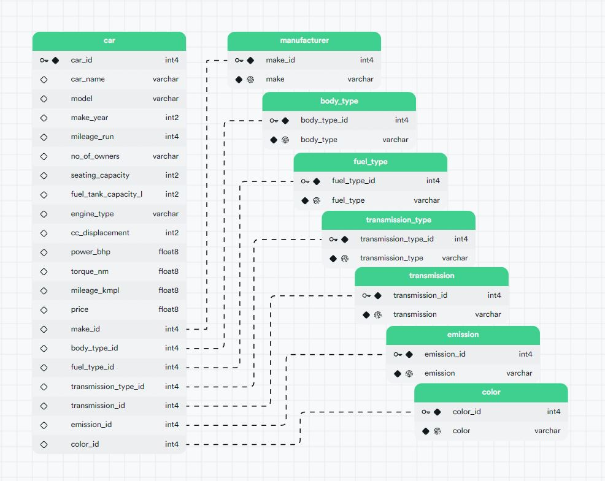

# DE 1.2: Car Trading Data Warehouse
Project for Turing College's Module 1: Introduction to Data Engineering, Sprint:2 Introduction to Relational Databases Practical Project.

## Project Overview
This repository contains a Streamlit web application designed to set up a data warehouse for a car trading startup. 
The application allows users to upload CSV files, execute SQL queries, and explore the database. 
It is intended to serve as a tool for data analysts to run ad-hoc queries on the available data, 
facilitating data-driven decision-making for the startup's launch in the Indian market. 

### **Project structure:**
- **app.py:** Main application file where the Streamlit app and its functionalities are implemented.
- **requirements.txt** File containing Python dependencies required for the project.
- **.env** Contains environment variables such as database credentials (not included in the repository).
- **config/**: Directory containing configuration settings and app code. 
- **config/config.py**  File containing streamlit webapp configuration.
- **config/code.py**  File containing Python code for the data warehouse. 
- **postgres_scripts/** Directory containing SQL scripts for the project.
- **img/** Directory containing image files.

### Project objectives:
- Practice setting up a Postgres database.
- Practice ingesting data from CSV files.
- Practice normalizing tables for efficient data storage and retrieval.

### Requirements:
- **Download Data:** Download the csv file from the [Used Cars Details Dataset](https://www.kaggle.com/datasets/rakkesharv/used-cars-detailed-dataset) for further use in the web app.

## Solution
- **Run the Streamlit App:**
Access the app through the provided URL: [Car Trading Data Warehouse](https://www.kaggle.com/datasets/rakkesharv/used-cars-detailed-dataset) 
- **Upload CSV Files:**
Navigate to the "Upload CSV" page, choose a CSV file, and click "Upload". The uploaded data will be displayed on the page.
- **Explore database:**
Navigate to the "Explore database" page, write SQL queries in the text area, and click "EXECUTE QUERY" to view query results.

### Infrastructure:
- ** Postgres (15.1.0.130) on AWS (eu-central-1)**

### Schema:

Drive Safely! 🛺
